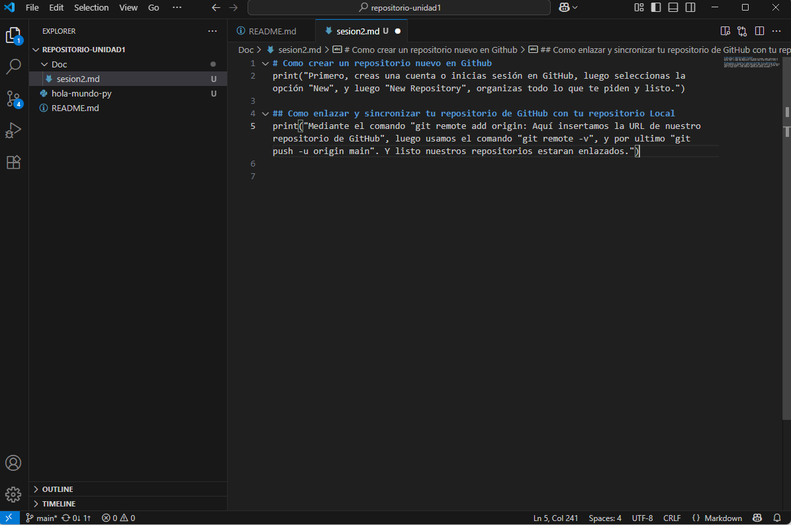

# Como crear un repositorio nuevo en Github 
### Primero, creas una cuenta o inicias sesión en GitHub, luego seleccionas la opción "New", y luego "New Repository", organizas todo lo que te piden y listo.

# Como enlazar y sincronizar tu repositorio de GitHub con tu repositorio Local 
### Mediante el comando "git remote add origin: Aquí insertamos la URL de nuestro repositorio de GitHub", luego usamos el comando "git remote -v", y por ultimo "git push -u origin main". Y listo nuestros repositorios estaran enlazados.

